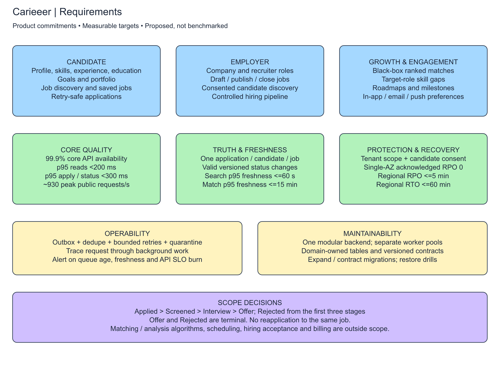
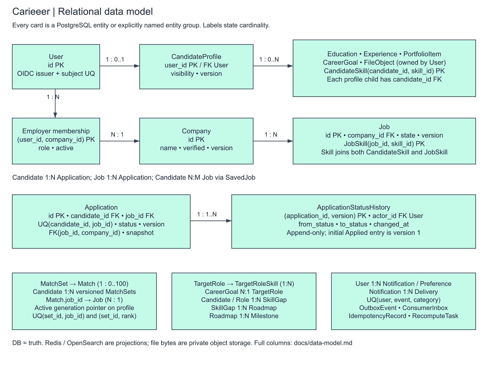
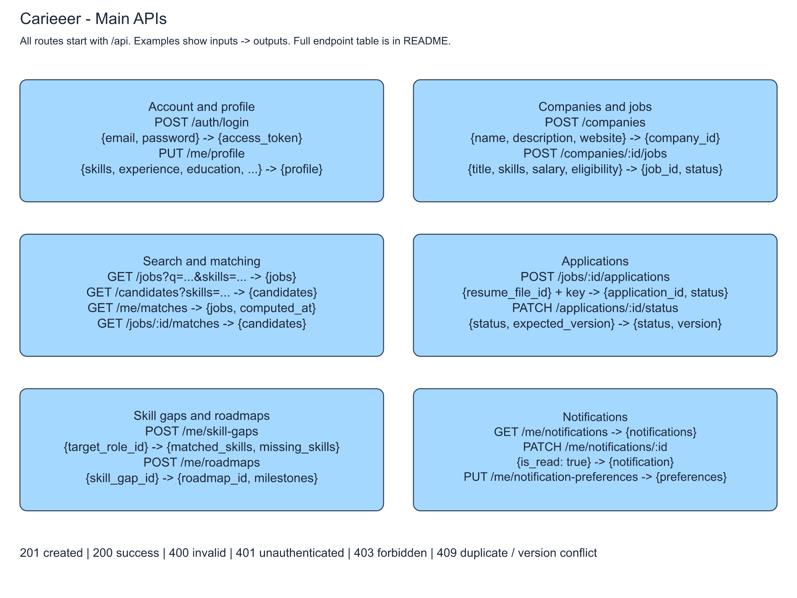
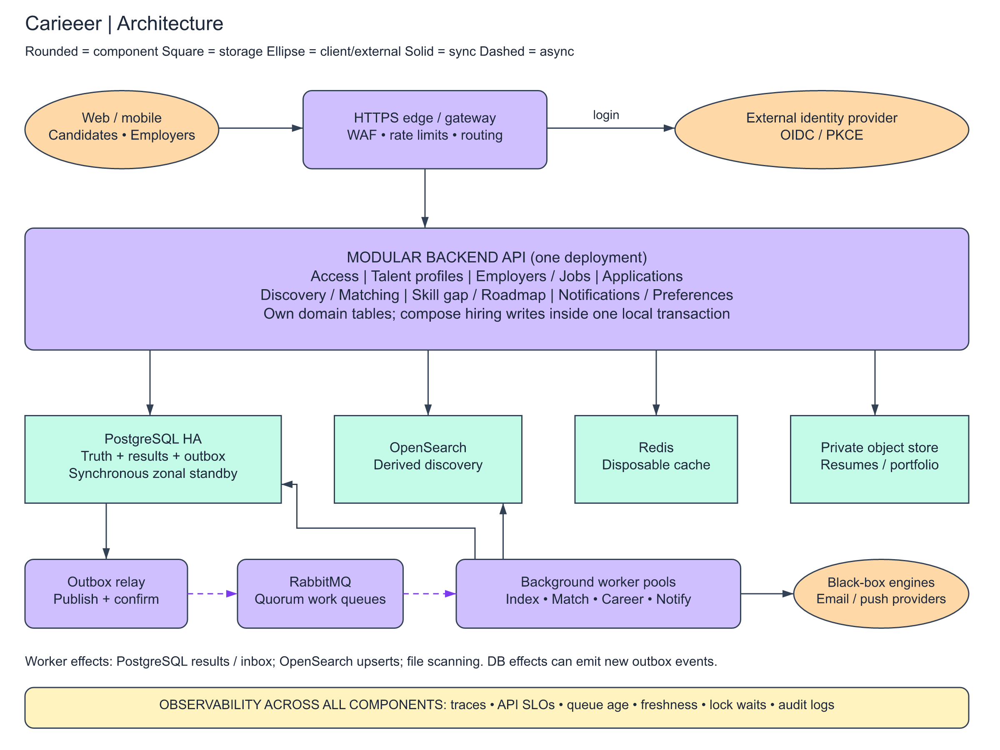
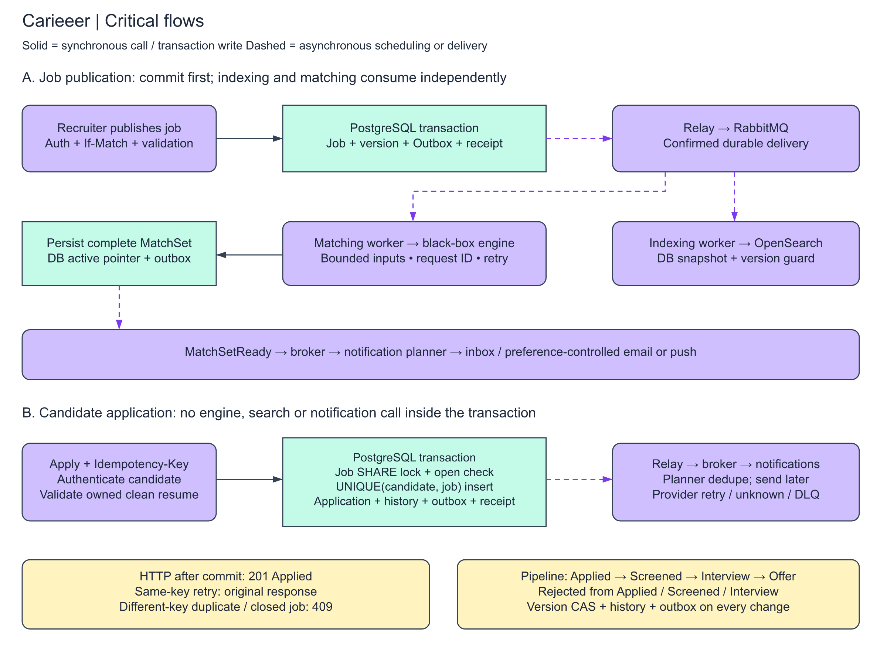

# Carieeer — System Design

Carieeer helps candidates find suitable jobs and see which skills they need for their next role. Employers can post jobs, find candidates and manage applications.

This repository contains the system design. It does not include an application implementation.

## 1. Requirements

### Functional requirements

- Candidates can manage skills, experience, education, career goals and portfolio.
- Employers can manage company information and create, edit or close job postings.
- Candidates can search jobs by keywords, skills and salary. Employers can search candidates by skills and experience.
- A matching engine recommends jobs to candidates and candidates to employers.
- Candidates can apply once per job and follow their application status.
- Employers can move applications through Applied, Screened, Interview, Offer and Rejected.
- Candidates can see missing skills for a target role and track roadmap milestones.
- Users receive notifications for matches, application changes and completed milestones.

### Non-functional requirements

| Requirement | Target or decision |
|---|---|
| Availability | Aim for 99.9% availability for the main API. Matching or notification failure should not stop applications. |
| Performance | Aim for most profile reads under 300 ms and searches under 500 ms. These are targets, not tested results. |
| Scalability | Start with one backend, then add backend instances and workers as traffic grows. |
| Consistency | Applications must not be duplicated. Search and matching results may take a short time to update. |
| Durability | Configure Supabase database backups and test recovery. Back up stored files separately. |
| Security | Use authentication, owner/company permission checks, HTTPS and private resume storage. |
| Reliability | Retry temporary background failures and keep failed tasks for investigation. |
| Maintainability | Keep features in separate backend modules. Log errors and monitor API latency and queue size. |



## 2. Data model

Use **Supabase** for this project. Supabase gives us a managed PostgreSQL database, Auth, and Storage in one place. PostgreSQL is useful here because jobs, users and applications have clear relationships, and applications need transactions and unique constraints.

| Entity | Main fields |
|---|---|
| User | id (references auth.users.id), name, account_type |
| CandidateProfile | user_id, bio, experience, education, career_goal, portfolio, searchable, revision |
| Company | id, name, description, website |
| Employer | user_id, company_id, role |
| Skill | id, name |
| CandidateSkill | candidate_id, skill_id, level |
| Job | id, company_id, title, description, salary_min, salary_max, currency, eligibility, status, revision |
| JobSkill | job_id, skill_id, required_level |
| Application | id, candidate_id, job_id, resume_file_id, status, version, created_at |
| ApplicationStatusHistory | id, application_id, old_status, new_status, changed_by, changed_at |
| Match | candidate_id, job_id, score, candidate_revision, job_revision, computed_at |
| TargetRole | id, title, required_skills |
| SkillGap | id, candidate_id, target_role_id, missing_skills, computed_at |
| Roadmap | id, candidate_id, skill_gap_id, milestones |
| Notification | id, user_id, event_id, message, is_read, delivery_status |
| NotificationPreference | user_id, push_enabled, matches_enabled |

Important relationships:

- Supabase Auth owns login credentials and email. The application User table stores profile information; it does not store passwords.
- One candidate profile belongs to one user. An employer links a user to a company.
- A company has many jobs. Candidates and jobs each have many skills through join tables.
- A candidate has many applications; a job receives many applications.
- Each application has a history of status changes.
- Matches connect candidates and jobs. Skill gaps connect candidates and target roles.

Add a unique constraint on **Application(candidate_id, job_id)**. Also keep one Match row per candidate/job pair. Experience, education and milestones can use structured JSON initially; separate tables would make sense if querying individual entries becomes important.

Small supporting records keep file ownership/scan status, pending events and request retry keys. These are explained in the deep dives rather than drawing a full database schema.



## 3. API design

Paths below start with `/api`. The examples show the main fields, not every optional field. The server identifies the user from authentication; a candidate cannot submit on someone else's behalf.

These are our backend routes, not Supabase's generated REST paths. Registration and login delegate to Supabase Auth. The backend verifies the Supabase access token before handling other routes. Registration may require email confirmation before a session is issued; users cannot grant themselves company-admin permissions through signup metadata.

| Method and endpoint | Request | Response |
|---|---|---|
| POST /auth/register | {name, email, password, account_type} | {user_id, confirmation_required} |
| POST /auth/login | {email, password} | {access_token} |
| PUT /me/profile | {bio, skills, experience, education, career_goal, portfolio, searchable} | {profile} |
| POST /me/files | Multipart resume or portfolio file | {file_id, status} |
| POST /companies | {name, description, website} | {company_id} |
| PUT /companies/:id | {name, description, website} | {company} |
| POST /companies/:id/jobs | {title, description, skills, salary_min, salary_max, currency, eligibility} | {job_id, status} |
| PATCH /jobs/:id | {description?, skills?, status?} | {job} |
| GET /jobs | Query: q, skills, salary_min, salary_max, currency, page | {jobs, next_page} |
| GET /candidates | Query: skills, min_experience, page | {candidates, next_page} |
| GET /me/matches | None | {jobs: [{job_id, score}], computed_at} |
| GET /jobs/:id/matches | None | {candidates: [{candidate_id, score}]} |
| POST /jobs/:id/applications | {resume_file_id}; Idempotency-Key header | {application_id, status} |
| GET /me/applications | Query: page | {applications, next_page} |
| GET /jobs/:id/applications | Query: status, page | {applications, next_page} |
| PATCH /applications/:id/status | {status, expected_version} | {application_id, status, version} |
| POST /me/skill-gaps | {target_role_id} | {skill_gap_id, matched_skills, missing_skills} |
| POST /me/roadmaps | {skill_gap_id} | {roadmap_id, milestones} |
| PATCH /me/roadmaps/:id/milestones/:milestone_id | {completed: true} | {milestone} |
| GET /me/notifications | Query: page | {notifications, next_page} |
| PATCH /me/notifications/:id | {is_read: true} | {notification} |
| PUT /me/notification-preferences | {push_enabled, matches_enabled} | {preferences} |

Return 201 for created resources, 200 for successful reads/updates, 400 for invalid input, 401 for missing authentication and 403 for denied access. Return 409 for an existing application or a conflicting status version. Lists have a maximum of 50 items per page.

Company changes require a company admin. Job management and applicant lists require membership in that job's company. Candidate discovery only returns profiles that allow it. Salary filters compare the same currency and annual pay period.

Jobs move from Draft to Open to Closed; only Open jobs accept applications. A file must belong to the candidate and pass scanning before it can be attached to an application.

For example:

```http
PATCH /api/applications/a1/status
Authorization: Bearer <token>
Content-Type: application/json

{"status":"Screened","expected_version":1}
```

```json
{"application_id":"a1","status":"Screened","version":2}
```



## 4. High-level architecture

Start with a **modular monolith**: one backend deployment with separate modules for profiles, jobs, applications, matching, career growth and notifications. This is easier to build and maintain than many separate services.



- **Backend API:** verifies Supabase tokens, checks permissions and calls the relevant module.
- **Supabase Auth:** handles signup, login and sessions.
- **Supabase Database:** managed PostgreSQL, the main source of truth for profiles, jobs and applications.
- **OpenSearch:** keyword search and filters. Its data is copied from PostgreSQL.
- **RabbitMQ and workers:** process matching, indexing and notifications in the background.
- **Supabase Storage:** private buckets for resume and portfolio files. PostgreSQL stores their references and scan status.
- **Redis, later if needed:** cache frequently read job details. It is not needed for application correctness.

The boxes inside the backend describe code modules, not separate servers. Matching and notification modules put expensive work on the queue. Workers read the required data and save results back to the database.

Application changes still go through the backend and a database transaction. Supabase does not replace the matching engine, dedicated search or background workers in this design. Keep business-write tables inaccessible to browser database calls; use Row Level Security (RLS) for any client-accessible tables and Storage policies for private files.

## 5. Main flows

### Publishing a job

Employer creates a job → backend saves it → background event is queued.

An indexing worker updates OpenSearch. A matching worker passes job/candidate data to the black-box engine, saves returned scores, and schedules notifications for relevant new matches.

### Applying for a job

Candidate applies → backend checks the job is open → database inserts the application and initial history → API returns success → notification is processed later.

The unique candidate/job constraint prevents two requests from creating two applications. The job-open check and insert happen in a transaction. See [Deep Dives](DEEP_DIVES.md) for the close-job race and retries.

### Application states

| Current state | Allowed next state |
|---|---|
| Applied | Screened or Rejected |
| Screened | Interview or Rejected |
| Interview | Offer or Rejected |
| Offer | None |
| Rejected | None |

Rejected is a terminal outcome that can be selected from Applied, Screened or Interview. Offer is also terminal in this design; there is no separate Accepted/Hired state. Backward moves and skipped stages are rejected.



## 6. Deep dives and estimates

[DEEP_DIVES.md](DEEP_DIVES.md) has short notes about the main design decisions. [docs/supabase.md](docs/supabase.md) explains the Supabase-specific Auth, RLS and Storage setup.

[ESTIMATION.md](ESTIMATION.md) contains a small capacity estimate. The main trade-off is keeping applications correct immediately while allowing search, matching and notifications to update shortly afterward.

## Files and diagrams

```text
README.md
DEEP_DIVES.md
ESTIMATION.md
diagrams/
  requirements.excalidraw
  data-model.excalidraw
  api-design.excalidraw
  architecture.excalidraw
  flows.excalidraw
  exports/                  # PNG and SVG previews
```

| Diagram | Editable file | Vector preview |
|---|---|---|
| Requirements | [Excalidraw](diagrams/requirements.excalidraw) | [SVG](diagrams/exports/requirements.svg) |
| Data model | [Excalidraw](diagrams/data-model.excalidraw) | [SVG](diagrams/exports/data-model.svg) |
| API design | [Excalidraw](diagrams/api-design.excalidraw) | [SVG](diagrams/exports/api-design.svg) |
| Architecture | [Excalidraw](diagrams/architecture.excalidraw) | [SVG](diagrams/exports/architecture.svg) |
| Main flows | [Excalidraw](diagrams/flows.excalidraw) | [SVG](diagrams/exports/flows.svg) |

The diagrams were created with Excalidraw MCP. The editable files and PNG/SVG previews use the same scene content; the previews use plain vector styling.

Supabase references: [Database](https://supabase.com/docs/guides/database/overview), [Auth user data](https://supabase.com/docs/guides/auth/managing-user-data), [Row Level Security](https://supabase.com/docs/guides/database/postgres/row-level-security), [Storage access](https://supabase.com/docs/guides/storage/security/access-control).
