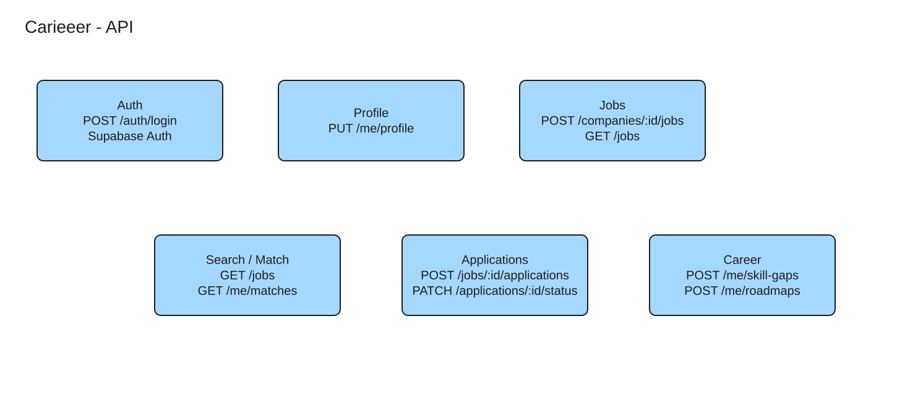

# REST API contract

All product routes use `/v1`. JSON examples use readable ID placeholders; actual IDs are UUIDs. Success timestamps are UTC RFC3339. Authentication uses an OIDC authorization-code flow with PKCE. The browser receives a Secure, HttpOnly, SameSite session cookie; native clients use short-lived bearer tokens. Cookie mutation requests require CSRF protection. Never accept a client-supplied candidate identity for self-service commands.

## Shared conventions

- Lists: `{items:[...],next_cursor:null|"opaque"}`; default 20, maximum 100. Cursor binds sort, filters and authorization scope; tampering yields 400. Avoid offset pagination for changing pipelines.
- Mutable resources return `ETag: "7"`; PATCH and lifecycle commands require `If-Match: "7"`. Missing → 428, stale → 412. Status commands also require an idempotency key.
- Commands marked **K** require `Idempotency-Key` (≤128 characters), scoped to authenticated actor and canonical route including resource ID. Keep committed receipts 24 h. Same key/body replays original code/body with `Idempotency-Replayed: true`; changed body/precondition gives 409 `IDEMPOTENCY_KEY_REUSED`. Hash method, route, canonical JSON and `If-Match`.
- Validate authorization before replaying a receipt. Replayed responses describe the original command, not current resource state; use GET for current state.
- Errors use `{error:{code:"JOB_CLOSED",message:"This job no longer accepts applications",request_id:"...",details:{}}}`. Common errors: 400 malformed/cursor, 401 unauthenticated, 403 forbidden, 404 absent or hidden cross-tenant resource, 409 domain conflict, 412 stale version, 422 invalid fields/transition, 428 precondition required, 429 throttled, 503 dependency/capacity failure. 429/503 include `Retry-After` where known. Never leak another candidate's application ID.

## Identity, talent and employers

| Method / path | Purpose / access | Request example | Response example | Constraints |
|---|---|---|---|---|
| GET `/auth/login` | Start browser OIDC | Query `return_to=/jobs` | 302 provider authorization URL | Allowlist relative return path; state/nonce/PKCE |
| GET `/auth/callback` | Complete login | Query `code=…&state=…` | 302 app, Set-Cookie session | Reject reused code/state; provider tokens stay server-side |
| POST `/auth/logout` | Revoke own session | `{}` | 204 | CSRF protected; repeated logout 204 |
| GET `/me` | Identity and roles | None | 200 `{id:"u1",candidate:true,memberships:[{company_id:"c1",role:"recruiter"}]}` | Current DB membership, not stale role token |
| GET `/me/profile` | Own full profile | None | 200 `{id:"u1",version:7,skills:[...],education:[...],experience:[...],goals:[...],portfolio:[...]}` | Owner only |
| PATCH `/me/profile` | Edit full owned sections | `If-Match`, `{headline:"Backend engineer",skills:[{skill_id:"s1",proficiency:3}],discovery_opt_in:true}` | 200 `{id:"u1",version:8}` | Supplied arrays replace that section; omitted fields unchanged; cap section sizes |
| POST `/me/files` **K** | Request quarantined upload | `{name:"cv.pdf",size:120000,mime:"application/pdf",checksum:"..."}` | 201 `{file_id:"f1",upload_url:"signed",expires_at:"..."}` | PDF/image allowlist, ≤10 MB, owner-bound key, 10-min upload URL |
| POST `/me/files/{id}/complete` **K** | Verify upload and enqueue scan | `{checksum:"..."}` | 202 `{file_id:"f1",scan_state:"pending"}` | Verify stored bytes/size; unavailable until scan clean |
| GET `/me/files/{id}` | Scan state/download access | None | 200 `{scan_state:"clean",download_url:"signed"}` | Only owner or authorized application viewer; URL ≤5 min |
| POST `/companies` **K** | Create company and admin membership | `{name:"Acme",domain:"acme.example"}` | 201 `{id:"c1",version:1,verification_state:"pending"}` | Publishing/discovery require verification; prevent domain impersonation |
| GET `/companies/{id}` | Public company view | None | 200 `{id:"c1",name:"Acme",verified:true,version:1}` | No member private information |
| PATCH `/companies/{id}` | Company admin edit | `If-Match`, `{name:"Acme Labs"}` | 200 `{id:"c1",version:2}` | Admin in company; 403 otherwise |
| PUT `/companies/{id}/employers/{user_id}` | Manage existing-user membership | `{role:"recruiter",active:true}` | 200 `{user_id:"u2",company_id:"c1",role:"recruiter",active:true}` | Admin; serialize membership edits on company row; cannot remove last admin; no email invitation assumed |

## Jobs and discovery

| Method / path | Purpose / access | Request example | Response example | Constraints |
|---|---|---|---|---|
| POST `/companies/{id}/jobs` **K** | Recruiter creates draft | `{title:"Backend Engineer",description:"...",skills:[{skill_id:"s1",required:true,proficiency:3}],experience_min_months:24,salary_min_minor:6000000,salary_max_minor:9000000,currency:"USD",pay_period:"year",work_mode:"remote",location:"US",deadline_at:"..."}` | 201 `{id:"j1",state:"Draft",version:1}` | Verified membership; min≤max; required publication fields validated |
| GET `/jobs/{id}` | Job detail | None | 200 `{id:"j1",state:"Published",version:2,company:{...},skills:[...]}` | Draft visible only to company; authoritative current state |
| PATCH `/jobs/{id}` | Recruiter edits job | `If-Match`, `{description:"..."}` | 200 `{id:"j1",version:3}` | Cannot move company or set state through PATCH |
| POST `/jobs/{id}/publish` **K** | Publish draft | `If-Match`, `{}` | 200 `{id:"j1",state:"Published",version:2}` | Draft only, verified company, complete fields, future deadline |
| POST `/jobs/{id}/close` **K** | Stop applications | `If-Match`, `{}` | 200 `{id:"j1",state:"Closed",version:4}` | Published only; lock job row against submissions |
| GET `/companies/{id}/jobs` | Recruiter management list | Query `state=Draft&cursor=…` | 200 `{items:[{id:"j1",...}],next_cursor:null}` | DB query, company scoped |
| GET `/search/jobs` | Discover jobs | Query `q=backend&skills=s1,s2&salary_min_minor=6000000&currency=USD&pay_period=year&experience_months=24&work_mode=remote&location=US` | 200 `{items:[{id:"j1",title:"..."}],next_cursor:"...",indexed_at:"..."}` | Skills AND by default; salary overlap filter, no cross-currency comparison; published filter + DB hydration |
| GET `/search/candidates` | Recruiter candidate discovery | Query `company_id=c1&q=backend&skills=s1&min_proficiency=3&min_experience_months=24&location=US` | 200 `{items:[{id:"u1",headline:"...",expertise:[...]}],next_cursor:null}` | Verified active company; opted-in only; no contact/resume in search |
| GET `/candidates/{id}` | Consented discovery profile | Query `company_id=c1` | 200 `{id:"u1",headline:"...",skills:[...]}` | Current consent + recruiter check; applicant snapshot accessed via application instead |
| PUT `/me/saved-jobs/{job_id}` | Save | `{}` | 204 | Repeat-safe natural key |
| DELETE `/me/saved-jobs/{job_id}` | Unsave | None | 204 | Absence also 204 |
| GET `/me/saved-jobs` | Saved list | Query cursor | 200 `{items:[{job_id:"j1",state:"Closed"}],next_cursor:null}` | Candidate owner; hydrate current job state |

Search salary ranges use overlap (`job.max >= requested.min`, `job.min <= requested.max`); jobs with undisclosed pay are excluded when a pay filter is present. Job experience filter finds requirements ≤ candidate experience; candidate experience filter finds experience ≥ recruiter minimum. Candidate expertise is canonical skill plus declared proficiency/evidence, not inferred private data. Search uses PIT + `search_after` with short-lived opaque cursors; expired search cursor → 410 `CURSOR_EXPIRED`, restart search. Hydration may shorten a page after revoked/closed hits are removed; bounded overfetch, never unbounded DB fallback.

## Matching and applications

| Method / path | Purpose / access | Request example | Response example | Constraints |
|---|---|---|---|---|
| GET `/me/matches` | Persisted job recommendations | Query `limit=20&cursor=…` | 200 `{generation:"g8",computed_at:"...",stale:false,items:[{job_id:"j1",rank:1,score:0.82,metadata:{}}],next_cursor:null}` | Does not invoke engine; active/eligible job and version checks |
| POST `/me/matches/refresh` **K** | Request recompute | `{}` | 202 `{task_id:"t1",state:"queued"}` | Coalesce; ≤1/minute per candidate; 429 over quota |
| GET `/jobs/{id}/matches` | Advisory candidate matches | Query cursor | 200 `{items:[{candidate_id:"u1",score:0.82,computed_at:"..."}],next_cursor:null}` | Hiring company only; latest sets + current consent; reverse view is bounded |
| POST `/jobs/{id}/applications` **K** | Apply as authenticated candidate | `{resume_file_id:"f1",cover_note:"..."}` | 201 `{id:"a1",job_id:"j1",status:"Applied",version:1}` + Location | 409 `ALREADY_APPLIED` with caller's existing ID; 409 `JOB_CLOSED`; 422 unclean/unowned file; DB transaction |
| GET `/me/applications` | Own application list | Query cursor | 200 `{items:[{id:"a1",status:"Applied",version:1}],next_cursor:null}` | Primary DB for read-your-write |
| GET `/applications/{id}` | Detail and status history | None | 200 `{id:"a1",status:"Screened",version:2,history:[{version:1,to:"Applied"},{version:2,from:"Applied",to:"Screened"}]}` | Candidate owner or current hiring-company member; internal recruiter notes omitted for candidate |
| GET `/jobs/{id}/applications` | Company pipeline | Query `status=Applied&cursor=…` | 200 `{items:[{id:"a1",snapshot:{...},version:1}],next_cursor:null}` | Current company membership; parameter cannot bypass scope |
| PATCH `/applications/{id}/status` **K** | Recruiter transition | `If-Match: "1"`, `{status:"Screened",reason:"Minimum qualifications reviewed"}` | 200 `{id:"a1",status:"Screened",version:2}` | 412 stale; 422 `INVALID_TRANSITION`; history/outbox same commit |

`GET /me/matches` returns empty items with `state:"pending"` when no generation exists. Cursors pin a generation, rank and job ID; expired generation → 410, restart. Mark stale if profile version changed, a relevant pending recomputation is overdue by 15 min, or result age exceeds the 24-hour refresh interval; filter any result whose job version no longer matches, is closed, or fails current eligibility. A coalesced background refresh is queued when needed, not executed in the read. The 15-minute freshness SLO measures trigger-to-ready delay, not a requirement to recompute every user every 15 minutes. Employer reverse-match pagination pins a short-lived materialized list of candidate IDs/generation IDs; revalidate each page, return 410 after expiry. This adds bounded storage but avoids unstable cross-candidate ordering.

## Career growth and notifications

| Method / path | Purpose / access | Request example | Response example | Constraints |
|---|---|---|---|---|
| GET `/target-roles` | Role templates | Query `q=backend` | 200 `{items:[{id:"r1",title:"Backend Engineer",version:3}],next_cursor:null}` | Versioned curated requirements |
| POST `/me/skill-gaps` **K** | Analyze target role | `{target_role_id:"r1"}` | 202 `{task_id:"t2",state:"queued"}` or 200 `{skill_gap_id:"sg1",cached:true}` | Same input digest reuses result; primary profile/role versions |
| GET `/me/tasks/{id}` | Poll owned background task | None | 200 `{state:"succeeded",result:{skill_gap_id:"sg1"}}` | queued/running/succeeded/failed; sanitized error and retryability |
| GET `/me/skill-gaps/{id}` | Analysis results | None | 200 `{id:"sg1",candidate_version:8,role_version:3,matched:["s1"],missing:[{skill_id:"s2",priority:"high"}],stale:false}` | Owner; stale flag on input revision |
| POST `/me/roadmaps` **K** | Adopt plan from analysis | `{skill_gap_id:"sg1"}` | 201 `{id:"rm1",version:1,milestones:[{id:"m1",skill_id:"s2",state:"todo"}]}` | Owner; reject stale analysis 409 unless explicitly acknowledged with `accept_stale:true` |
| GET `/me/roadmaps/{id}` | View plan/progress | None | 200 `{id:"rm1",version:1,milestones:[...]}` | Owner |
| PATCH `/me/roadmaps/{id}/milestones/{mid}` **K** | Complete milestone | `If-Match` milestone version, `{state:"done"}` | 200 `{id:"m1",state:"done",version:2}` | todo → done only in scope; immutable completion event per version |
| GET `/me/notifications` | Inbox | Query `unread=true&cursor=…` | 200 `{items:[{id:"n1",category:"application_status",read_at:null}],next_cursor:null}` | Owner; payload contains safe link, hydrate live permission |
| PUT `/me/notifications/{id}/read` | Mark read | `{}` | 204 | Repeat-safe; preserve first read_at |
| GET `/me/notification-preferences` | View effective settings | None | 200 `{preferences:[{category:"matches",channel:"email",enabled:false}]}` | Owner |
| PUT `/me/notification-preferences` | Replace overrides | `{preferences:[{category:"matches",channel:"email",enabled:false}]}` | 200 `{preferences:[...]}` | Validate category/channel; recheck immediately before external send |

## State and conflict contract

| Current | Allowed next |
|---|---|
| Applied | Screened, Rejected |
| Screened | Interview, Rejected |
| Interview | Offer, Rejected |
| Offer | None |
| Rejected | None |

There is no skip from Applied to Offer, no same-status mutation, and no reopening. A same-key retry of a successful transition returns the original response even if the application subsequently advanced. Different keys racing at version 1 produce one success and one 412. Applications to different jobs are allowed; no undisclosed exclusivity rule is imposed. See [transaction algorithms](flows.md) for job-close races, unique violations and retry behavior.
