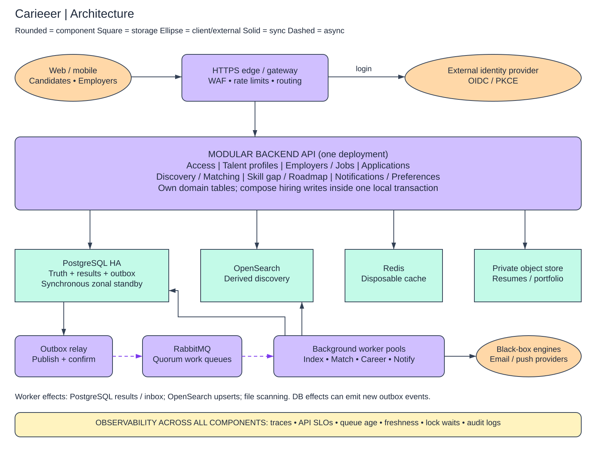

# Architecture and ownership

## Deployment, not a service-per-entity diagram

One stateless Backend API codebase contains seven modules. The same domain libraries run in background worker deployments. Start with at least three API replicas distributed across zones, a managed PostgreSQL primary with a synchronous cross-AZ standby, and managed RabbitMQ/OpenSearch. Redis can fail without losing business records. These are starting topology choices, not measured node-size guarantees.

| Module | Owns writes / responsibilities |
|---|---|
| Access | User, sessions/identity mapping, authentication integration, shared authorization policies |
| Talent | CandidateProfile, skills and profile children, goals, saved jobs, file metadata |
| Employers/jobs | Company, Employer membership, Job and JobSkill, publish/close policy |
| Applications | Application, status history, submission snapshots, transition service |
| Discovery/matching | Search query adapter, MatchSet/Match, ranking task orchestration, generation validity |
| Career growth | TargetRole, requirements, SkillGap, Roadmap, Milestone, analysis orchestration |
| Notifications | Preferences, logical Notification, per-channel Delivery, in-app reads |

Modules may read through internal interfaces; no direct writes into another module's tables. The apply handler composes job and application domain operations in one DB transaction. No network call inside that transaction. A shared persistence layer manages outbox and command idempotency atomically with domain writes.

## Synchronous path

Clients → HTTPS edge (WAF/rate limits/load balancing) → Backend API → PostgreSQL. The API validates OIDC issuer/audience/signature/expiry and checks current account/membership state. It reads OpenSearch only for discovery, then batch-hydrates authorized results from PostgreSQL. Match/roadmap reads use persisted results, optionally Redis. Private file access is an authorized short-lived signed URL; bytes travel directly between client and object storage.

Identity provider, matching/analysis engine, and email/push providers are external boundaries. No engine internals are assumed. The architecture overview groups external capabilities in one shape; they have separate clients, timeouts, quotas, and failure budgets in implementation.

## Asynchronous path

A domain transaction also writes `OutboxEvent`. A relay leases rows, publishes persistent messages to a durable topic exchange, waits for publisher confirmation and checks unroutable returns, then marks dispatch. RabbitMQ quorum queues provide separate subscriptions for search indexing, matching scheduling, career recomputation, and notification planning. Acknowledgement follows the consumer's durable effect, never precedes it.

Search workers write OpenSearch; matching workers call the engine then persist a complete generation to PostgreSQL; notification planners write inbox/delivery records, and send workers contact providers. Those new DB effects can themselves append events, e.g. `MatchSetReady`. Object scanning is another queue task, not part of the hiring transaction.

The overview's worker → DB arrow includes inbox dedupe, result writes, and event creation; API → search/cache/storage arrows represent adapters, not new services. Solid arrows are synchronous calls or local database writes; dashed arrows are asynchronous scheduling/event delivery. Database shapes have square corners, components rounded corners, and external/client shapes are ellipses. Observability is a labeled cross-cutting band to avoid drawing an arrow from every component.

## Data placement

- **PostgreSQL:** authoritative business state plus durable derived results, outbox/inbox, command receipts, and delivery state. Transactional facts cannot be recovered from Redis or search.
- **OpenSearch:** rebuildable job and consented candidate discovery documents; no resumes or contact details. Dedicated full-text/faceted queries prevent broad filtering from monopolizing transactional CPU.
- **Redis:** optional short-lived job detail caches and version-addressed recommendation pages, plus rate-limit counters. Never use as application uniqueness authority.
- **Private object storage:** resumes/portfolio objects with metadata/ownership in PostgreSQL. Quarantine and clean prefixes/buckets; signed URLs only after scan approval.
- **RabbitMQ:** bounded asynchronous work and fan-out, not permanent business storage. Retained outbox plus authoritative snapshots support replay/rebuild.

## Scale and evolution

Independent worker pools keep matching CPU/provider delays away from apply latency. Use per-pool connection budgets and a DB pooler; more API replicas must not multiply DB sessions without limit. Read replicas serve stale-tolerant analytics and selected public reads only. Primary handles applications, membership/consent, and generation eligibility checks.

Separate a module into a service only when measured workload, ownership, or release isolation justifies network contracts and distributed failure handling. Matching workers are already an isolation boundary without requiring separate ownership of core profile tables. Defer sharding, event sourcing, multi-region writes, and a Kafka platform until actual limits demand them.

[Detailed trade-offs](../DEEP_DIVES.md) · [Flow contracts](flows.md)
