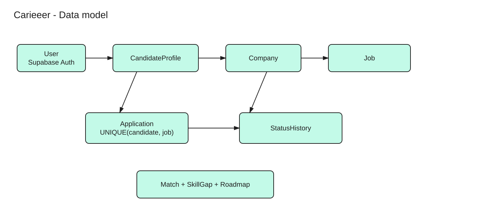

# Data model

PostgreSQL is the transactional source of truth. UUID primary keys are server-generated; times are UTC `timestamptz`. Mutable aggregates have positive bigint `version`, `created_at`, and `updated_at`. Money uses bigint minor units, never floating point. Foreign keys are indexed when used for joins/deletes; declaring an FK alone is not an indexing plan.

## Identity, talent and hiring

| Entity | Important columns / constraints | Relationships |
|---|---|---|
| User | id PK, oidc_subject UNIQUE with issuer, email, account_state | 1 → 0..1 CandidateProfile; 1 → 0..N Employer memberships |
| CandidateProfile | user_id PK/FK User, headline, location, experience_months, discovery_opt_in, version | Parent of talent children; candidate ID is user ID |
| Employer | user_id FK User, company_id FK Company, role admin/recruiter, active; PK(user_id,company_id) | User N:M Company through membership |
| Company | id PK, name, domain, verified_at, version | 1 → 0..N Job; 1 → 1..N active members enforced by admin workflow |
| Skill | id PK, canonical_name UNIQUE, aliases | Referenced by CandidateSkill, JobSkill and TargetRoleSkill |
| CandidateSkill | candidate_id FK, skill_id FK, proficiency CHECK 1..5, evidence; PK(candidate_id,skill_id) | Candidate N:M Skill |
| Education | id PK, candidate_id FK, institution, qualification, start/end | Candidate 1 → 0..N |
| Experience | id PK, candidate_id FK, employer_name, title, dates, description | Candidate 1 → 0..N; employer_name need not be a registered Company |
| PortfolioItem | id PK, candidate_id FK, title, url OR file_id FK FileObject | Candidate 1 → 0..N; validate URL protocols |
| CareerGoal | id PK, candidate_id FK, target_role_id FK, target_date | Candidate 1 → 0..N goals |
| FileObject | id PK, owner_id FK User, object_key UNIQUE, checksum, size, mime, scan_state | Stored bytes outside DB; clean state required for use |
| Job | id PK, company_id FK, created_by FK User, title, description, location, work_mode, experience_min_months, salary_min/max_minor, currency, pay_period, deadline_at, state, version | Company 1 → 0..N; Draft → Published → Closed |
| JobSkill | job_id FK, skill_id FK, required, proficiency; PK(job_id,skill_id) | Job N:M Skill |
| SavedJob | candidate_id FK, job_id FK, created_at; PK(candidate_id,job_id) | Candidate N:M Job; saving does not apply |
| Application | id PK, candidate_id FK, job_id FK, company_id, status, version, snapshot JSONB, resume_file_id FK, submitted_at | Candidate/Job each 1 → 0..N; UNIQUE(candidate_id,job_id); composite FK(job_id,company_id) to Job |
| ApplicationStatusHistory | application_id FK, version, from_status nullable on initial entry, to_status, actor_id FK, reason, changed_at; PK(application_id,version) | Application 1 → 1..N committed transitions; append-only |

Snapshots contain only the profile and scanned resume reference shared at submission, not arbitrary user JSON. A profile edit must not retroactively change the application reviewed by an employer. `company_id` on Application supports tenant-filtered pipeline indexes; the composite FK prevents a mismatched job/company pair. Company/job/candidate deletion is restricted while retained application records exist; a controlled erasure job redacts personal fields instead of cascading away history.

## Derived recommendations and career growth

| Entity | Important columns / constraints | Relationships |
|---|---|---|
| MatchSet | id PK, candidate_id FK, generation, candidate_version, engine_version, input_digest, computed_at, state building/ready/superseded; UNIQUE(candidate_id,generation) | Candidate 1 → 0..N generations; profile has nullable active_match_set_id |
| Match | match_set_id FK, job_id FK, job_version, rank, score numeric, metadata JSONB; PK(match_set_id,job_id); UNIQUE(match_set_id,rank) | MatchSet 1 → 0..100 jobs; Job 1 → 0..N matches |
| TargetRole | id PK, title, version | Curated role template; skills updated with aggregate version |
| TargetRoleSkill | target_role_id FK, skill_id FK, required_proficiency, priority; PK(target_role_id,skill_id) | TargetRole N:M Skill |
| SkillGap | id PK, candidate_id FK, target_role_id FK, candidate_version, role_version, analyzer_version, input_digest, matched/missing JSONB, computed_at | Immutable analysis; UNIQUE(candidate_id,target_role_id,input_digest,analyzer_version) |
| Roadmap | id PK, candidate_id FK, skill_gap_id FK, version, created_at | Candidate 1 → 0..N; each belongs to one analysis |
| Milestone | id PK, roadmap_id FK, skill_id nullable FK, ordinal, title, state todo/done, version, completed_at | Roadmap 1 → 1..N; UNIQUE(roadmap_id,ordinal) |

One canonical candidate-centric match set avoids contradictory candidate and employer score stores. `GET /jobs/{id}/matches` reverses the latest eligible candidate sets via an index and returns only consenting candidates. It is an advisory, bounded view, not an exhaustive ranking of all candidates. Initially a newly published job may have no reverse matches until targeted recomputation finishes. Keep current plus previous generation for cursor stability for 24 hours; expire older sets thereafter. Analysis changes create a suggested new roadmap; the user explicitly adopts it, preserving old progress.

## Notifications and reliability records

| Entity | Important columns / constraints | Relationships |
|---|---|---|
| NotificationPreference | user_id FK, category, channel, enabled; PK(user_id,category,channel) | User 1 → 0..N overrides; defaults documented by product |
| Notification | id PK, user_id FK, event_id, category, safe_payload, read_at, created_at; UNIQUE(user_id,event_id,category) | User 1 → 0..N logical inbox records |
| NotificationDelivery | notification_id FK, channel, state pending/sending/accepted/failed/suppressed/unknown, attempt_count, lease_until, provider_id, next_attempt_at; PK(notification_id,channel) | Notification 1 → 0..N external delivery attempts/state records |
| OutboxEvent | event_id PK, aggregate_type/id/version, type, schema_version, payload, created_at, lease_until, published_at | Written with domain transaction; no PII-heavy snapshots in payload |
| ConsumerInbox | consumer_name, event_id, processed_at; PK(consumer_name,event_id) | Dedupe committed DB effects per subscription |
| IdempotencyRecord | actor_id, route_scope, key, request_hash, response_code/body, expires_at; PK(actor_id,route_scope,key) | Command receipt in same transaction as mutation; 24 h retention |
| RecomputeTask | task_key PK, candidate_id FK, task_type match/skill_gap, target_role_id nullable FK, requested_version, reason, state queued/running/succeeded/failed, result_ref, safe_error, attempt_count, lease_until, next_attempt_at | Durable coalescing, leasing and retry control; one pending latest task per candidate/type/target; exposes owned polling ID |

## Query-driven indexes

| Access pattern | Index / plan |
|---|---|
| Candidate application history | `(candidate_id, submitted_at DESC, id DESC)`; keyset pagination |
| Employer pipeline by stage | `(company_id, job_id, status, submitted_at DESC, id DESC)`; company predicate mandatory |
| Application uniqueness | UNIQUE `(candidate_id,job_id)`; do not rely on check-then-insert |
| Profile and job skill lookup | CandidateSkill `(skill_id,candidate_id)` and JobSkill `(skill_id,job_id)` in addition to composite PKs |
| Company jobs | `(company_id, state, created_at DESC, id DESC)` |
| Employer reverse matches | Match `(job_id,match_set_id,score DESC)` plus MatchSet candidate/current-generation filter; benchmark and cap work |
| Candidate recommendation pages | `(match_set_id,rank)` unique index; deterministic rank then job ID |
| Pending outbox/delivery/task | Partial indexes on due time where unfinished; lease with `FOR UPDATE SKIP LOCKED` |
| Inbox | `(user_id,created_at DESC,id DESC)`; partial unread index if measured useful |

Use `EXPLAIN (ANALYZE, BUFFERS)` against representative tenant sizes in staging. Bound lists to 100 records; batch-hydrate search results, avoid N+1 profile/skill queries. Do not add indexes to every field: they amplify the 600k/day notification workload. Time-partition high-volume Notification/history/outbox only when retention cleanup or vacuum behavior justifies it; do not partition Application in a way that weakens global candidate/job uniqueness.

[Core SQL](schema-core.sql) intentionally implements only the application consistency kernel, not the entire catalog. Remaining entities above are a design specification, not a claim of runnable full backend code.
