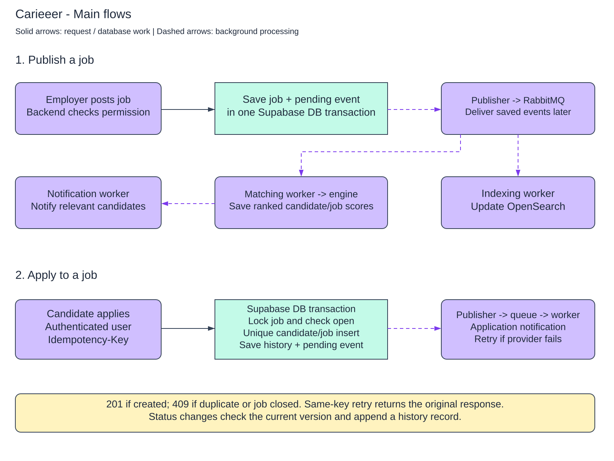

# Critical flows and execution contracts



## 1. Publish a job

1. **Synchronous:** authenticate recruiter, verify current company membership, validate fields and `If-Match`, claim command receipt in a DB transaction. Lock the Job row `FOR UPDATE`; validate Draft state and publication requirements. Update state/version and append `JobPublished` to OutboxEvent. Store response and commit. Return 200 after commit.
2. **Asynchronous:** relay publishes the durable event to RabbitMQ with confirmation. Independent search and matching subscriptions receive it; one subscription failing does not prevent the other from acknowledging.
3. Indexing worker loads the authoritative job snapshot/version and writes a full OpenSearch document with external version checking. It never constructs current state by applying unordered partial patches.
4. Matching scheduler selects a bounded, consent-appropriate shortlist using canonical skill/eligibility metadata and the new job from PostgreSQL. It does not require the new job to have reached OpenSearch. Queue at most 100 candidate refreshes per new/updated job initially; dedupe/coalesce by candidate. Rotate a measured exploration cohort for coverage.
5. Matching workers produce complete candidate-centric generations, persist top results, and switch the active pointer atomically. `MatchSetReady` goes through the outbox. Candidate sees results from DB/cache without running the engine in a request.
6. Notification planner detects newly qualifying top matches relative to the previous generation, applies threshold/daily-cap policy and creates a logical inbox record. Email/push delivery is independent, preference-controlled background work. Not every score change sends an alert.

Job updates increment version and emit `JobUpdated`; closure emits `JobClosed`. The read path filters closed/outdated jobs immediately from DB. A deadline is checked using current DB time at submission even if the periodic expiration-to-Closed task is delayed.

## 2. Apply: transaction and races

Use PostgreSQL READ COMMITTED, explicit locks and a unique index. A cache lock or a preliminary SELECT cannot enforce uniqueness. The command sequence is:

```text
authenticate candidate; validate syntax and key
BEGIN
  claim (actor, canonical route, key) in IdempotencyRecord with request hash
  if committed receipt exists: compare hash; return stored outcome
  if another transaction owns key: wait briefly or return retryable busy response
  lock candidate/account row FOR SHARE; verify active account and owned clean resume
  SELECT job ... FOR SHARE              -- concurrent applicants may share lock
  verify Published and deadline_at > clock_timestamp() (or no deadline)
  INSERT Application (... Applied, version=1, authoritative snapshot)
    ON CONFLICT (candidate_id,job_id) DO NOTHING RETURNING id
  if not inserted: read existing own application, record 409 ALREADY_APPLIED
  else INSERT initial ApplicationStatusHistory, INSERT ApplicationSubmitted outbox
  save final HTTP code/body in command receipt
COMMIT
return response
```

`FOR SHARE` conflicts with a job update/close but permits concurrent applicants. Close takes `FOR UPDATE` on the same job row. If apply gets the share lock first, its eligibility check is ordered before closure and may succeed; if close commits first, apply sees Closed and returns 409. Job deadline eligibility is defined at the locked check, not at response arrival. Acquire locks in a documented order (account/candidate, membership/company where relevant, job, application) and keep transactions short. Profile edits lock the candidate aggregate exclusively so the submitted snapshot has a coherent revision.

Different idempotency keys racing for the same candidate/job converge through UNIQUE(candidate_id,job_id): one inserts, the other returns 409 after the winner commits. `ON CONFLICT DO NOTHING` avoids aborting the transaction before saving the conflict response. If the winner rolls back, the contender can insert. No HTTP response is considered successful before COMMIT. A lost response after commit is recovered from the receipt; a receipt expired after 24 h loses exact response replay but the permanent unique constraint still prevents a second application.

Resume scan state and account eligibility checks happen against authoritative rows under appropriate locks; file deletion cannot race past a retained application reference. Membership revocation uses the same locking discipline as hiring writes: a status transaction takes a share lock on the membership row and validates active role; revocation takes the conflicting update lock. Authorization at transaction admission is the linearization point for that in-flight command.

## 3. Advance an application

Inside a transaction, claim the command receipt, authorize hiring-company membership under lock, and read the application. Validate the expected version before the transition. Execute:

```sql
UPDATE application
SET status = :next_status, version = version + 1
WHERE id = :id AND company_id = :authorized_company
  AND version = :expected_version
RETURNING *;
```

The handler and SQL guard permit only the [state table](api-design.md#state-and-conflict-contract). Zero updated rows after authorization means 412; invalid transition on a current version means 422. Append history at the new version and `ApplicationStatusChanged` to outbox; save the receipt and commit. A crash before commit leaves none of these effects. A crash afterward leaves all. History PK(application_id,version) guards duplicate append. The runtime role cannot mutate prior history. Same-key replay happens before re-evaluating `If-Match` against the now-new version.

## 4. Black-box matching contract

The engine is an external port, not an implementation proposal. A representative internal request is:

```json
{
  "request_id": "candidate-u1-generation-8",
  "engine_version": "contract-v1",
  "candidate": {"id":"u1","version":8,"skills":[{"id":"s1","proficiency":3}],"experience_months":36,"eligibility":{"locations":["US"],"work_modes":["remote"]}},
  "jobs": [{"id":"j1","version":2,"skills":[{"id":"s1","required":true}],"experience_min_months":24,"eligibility":{"location":"US","work_mode":"remote"}}],
  "limit": 100
}
```

Response: `{request_id,engine_version,results:[{job_id,job_version,score,metadata}],completed_at}`. Scores are engine-defined and meaningful only under the declared engine version; the sample API score is illustrative. The adapter validates IDs, duplicates, finite numeric scores and result count; deterministic tie-break is job ID. No embeddings, training data, model architecture, or explainability claims are assumed. Eligibility inputs use candidate-provided job-relevant constraints, not protected characteristics. Do not send names, emails or resumes when structured attributes suffice.

Candidate changes, job publication/material changes/closure, explicit refresh and a daily refresh of active candidates trigger recomputation. Build up to 500 eligible job inputs per candidate using indexed canonical metadata; include the triggering job if eligible. This is bounded retrieval, not an exhaustive candidate×job cross product. Candidates missed by the initial fan-out are explored in scheduled cohorts; measure recall on a sampled broader evaluation, do not assume it.

Assign a monotonic generation when scheduling. Lease task; capture candidate/job versions; call engine outside a DB transaction with a 10 s timeout. For capacity calculations assume 0.5 s average service time, which must be measured. After return, lock candidate generation state, recheck profile revision and latest requested generation. An older in-flight completion cannot replace a newer generation. Insert result set and rows, mark ready, switch pointer and append outbox in one transaction. Changed job versions are excluded from the returned set and schedule a refresh; enforce job eligibility again on every read.

Retries use the same request ID and bounded exponential backoff with jitter (1 s, 5 s, 30 s, 2 min, 10 min). Engine idempotency is preferred; if unsupported, repeated computation may cost extra, but DB generation uniqueness prevents duplicate visible sets. On persistent failure keep eligible older results marked stale and quarantine the task. Input digest includes candidate revision, sorted job IDs/versions, engine version and retrieval policy version. Version-addressed Redis pages expire after five minutes; current pointer is read from DB. Results are paginated within a fixed generation and retained for cursor lifetime.

## 5. Skill gap and roadmap

Read CandidateProfile revision plus TargetRole/TargetRoleSkill revision, calculate input digest, and reuse an identical SkillGap result if present. Otherwise queue an owned task. Analyzer input is `{candidate_skills,experience,role_required_skills,role_version}`; output is `{matched_skills,missing_skills:[{skill_id,priority,required_proficiency}],suggested_milestones}`. Validate against the skill catalog. Treat analysis as a domain black box; no AI requirement.

Persist immutable SkillGap keyed by digest/analyzer version. If inputs changed in flight, preserve the result as stale and enqueue latest input; never label old output current. GET compares current revisions. Profile/role updates coalesce recomputation for active goals only, with a 15-minute normal-load freshness target. Roadmap adoption copies suggestions into stable milestone IDs; progress is not overwritten on recomputation. Completion transaction appends `MilestoneCompleted`; notifications dedupe on event ID.

## 6. Event and notification contract

```json
{"event_id":"e1","type":"ApplicationStatusChanged","schema_version":1,"aggregate_type":"Application","aggregate_id":"a1","aggregate_version":2,"occurred_at":"2026-09-14T10:00:00Z","trace_id":"...","payload":{"company_id":"c1","candidate_id":"u1","from":"Applied","to":"Screened"}}
```

Delivery is at least once; global ordering is not required. Projection consumers reject lower aggregate versions; notifications use both event dedupe and current application version to suppress an obsolete queued external status alert. Status history remains complete even when old alerts are suppressed. Notification planner transaction inserts ConsumerInbox + Notification + per-channel Delivery. Send workers lease Delivery records, recheck preferences and current permissions, call provider with a stable delivery ID, then record acceptance. DB transactions cannot make an external provider atomic: a timeout after acceptance is `unknown`, reconciled by provider query/webhook if supported. Otherwise retry under a bounded policy with a documented residual duplicate risk.

Default product policy: in-app application/milestone alerts enabled, match alerts digest-capped; external channels opt-in. A suppression records why delivery was skipped. Provider callbacks are signature-verified and deduped by provider event ID; acceptance is not proof of human receipt. Inbox links fetch live authorized resources, so an old notification does not grant continuing access.
